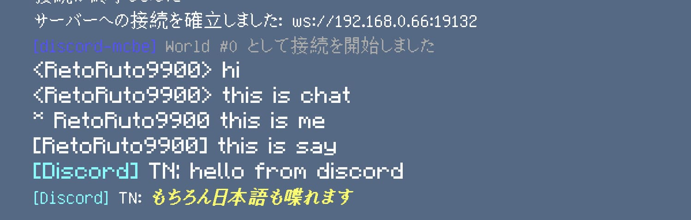
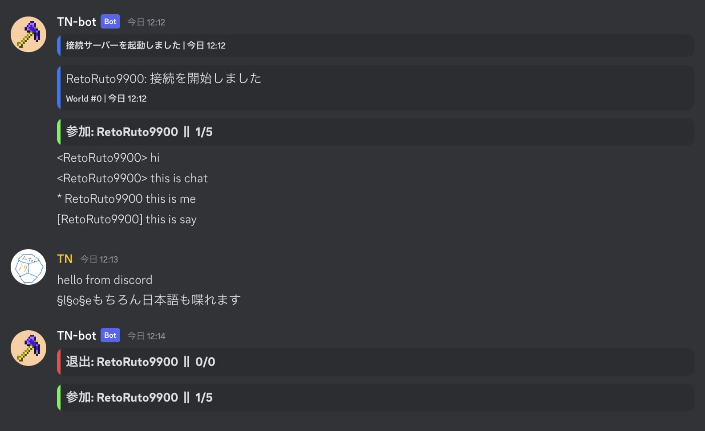
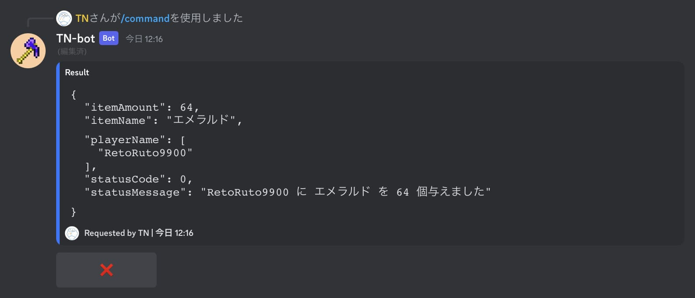
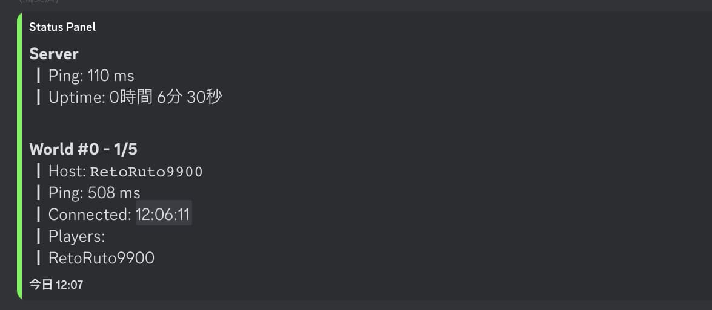

> [README_en.md](README_en.md) (English)is here

# discord-mcbe
  
   
<a href="https://github.com/tutinoko2048/discord-mcbe/releases">
  
</a>
  
MinecraftBEでdiscordとチャットを繋ぐことができるDiscord Botです。バニラ環境で動きます。  
https://youtu.be/BEv4oozeQKU  
  
</br>
</br>
  
[Discord サポートサーバー](https://discord.gg/XGR8FcCeFc)

## 動作環境
- 基本的にはWindowsのPCでの動作を想定しています
- MinecraftBEのシングル/マルチワールド用です。BDSなどのサーバーでは使用できません
- 双方向のチャットするにはワールドのホスト(鯖主)が繋げる必要があります

## 使い方
### Nodejsをインストール
Nodejs v18以上をインストールしてください  
https://nodejs.org/ja/  

### botを作る
discordのbotが必要なので用意してください。  
(botアカウントの作り方はここでは省略します)  

### Configを編集
[ここから最新のものをダウンロード](https://github.com/tutinoko2048/discord-mcbe/releases)して展開してください。gitからcloneしても構いません。  
その中の`config.jsonc`ファイルを編集して必要な値を入力してください  
[Configの内容はこちらから](#config)

### 動かす
> **Note**: マイクラの設定で `暗号化されたWebsocketの要求` がオフになっていることを確認してください  
  
> **Note**: PCで動かす場合はループバック接続を許可してください [詳しくはこちら](#ループバック接続の許可)  

`start.cmd`を実行してサーバーを起動させましょう。  
次にマイクラ側で  
```/connect [ローカルIP]:[ポート]```  
```/connect localhost:[ポート]``` (同じ端末の場合)  
のコマンドを実行します  
これで接続することができます

## コマンド一覧
- /help  
ボットのヘルプを表示します

- /ping  
ボットとワールドの応答速度を表示します

- /list  
プレイヤーリストを表示します

- /command <コマンド> [ワールド]  
ワールドにコマンドを送信します。従来通りメッセージから送信することも可能です。  
[詳しくはこちら](#コマンドの実行)

- /tell <送り先> <メッセージ>  
tellでメッセージをプレイヤーに送信します。周りからは見られません

- /panel get  
ステータスパネルのあるチャンネルを表示します  
[詳しくはこちら](#ステータスパネル)

- /panel set  
ステータスパネルを表示するチャンネルを設定します

- /panel delete  
ステータスパネルを削除します

## ループバック接続の許可
同じPC内で通信をするには設定が必要になる場合があります。  
こちらのコマンドをコマンドプロンプトで**管理者権限**で実行してください  
`CheckNetIsolation LoopbackExempt -a -n="Microsoft.MinecraftUWP_8wekyb3d8bbwe"`  
または `loopback.cmd` を実行してください(同じコマンドが入っています)

## Config
(必須)  
- `discord_token`: botのトークン  
- `guild_id`: このbotを使うサーバー(Guild)のID  
- `channel_id`: メッセージを送信するチャンネルのID  

(任意)  
- `port`: websocket接続に使用するポート
- `language`: 使用する言語 langフォルダのファイル名
- `timezone`: 時刻表示に使うタイムゾーン
- `command_role_id`: マイクラへのコマンドの送信を許可するロールのID  
文字の配列で指定します (EX: `[ "ロールID1", "ロールID2",... ]`)
- `ready_message`: サーバー起動時に通知メッセージを送信
- `delete_color_prefix`: discord送信時に§とその後の文字を削除するか
- `panel_update_interval`: ステータスパネルの更新間隔(ミリ秒単位)
- `scripts_entry`: 実行するスクリプトのエントリポイント
- `command_version`: マイクラに送るコマンドのバージョン
- `debug`: デバッグログを有効化
- `styles_tnac`: TN-AntiCheatからのメッセージを強調する

## その他の機能
### コマンドの実行
`/command <送信するコマンド>` または `/送信するコマンド` でワールドにコマンドを送ることができます。  
専用ロールを作成し、configの`command_role_id`にロールIDを入力して権限を取得してください  


### ステータスパネル
pingや人数の情報をリアルタイムで更新するパネルです  
`/panel set` で実行したチャンネルにパネルを設置します  


### コンソール
コンソールからコマンドを送信することができます。文字の先頭に.を付けるとコードをevalで実行します

### カスタムスクリプト
websocketサーバーやdiscordのbotの機能をカスタマイズできます  
サーバーは`server` botは`client`にインスタンスが入っています。ws鯖については[SocketBEのページ](https://github.com/tutinoko2048/SocketBE)をご覧ください  
configのscripts_entryで指定したファイルが自動で読み込まれます

### TNACとの連携
[TN-AntiCheat](https://github.com/tutinoko2048/TNAntiCheat)からのメッセージを強調表示できます(configで設定)  
TNAC側のconfig `others/sendws` もオンにしてください

## Contributing & Translation
改善点、問題点などのPull RequestやIssueは大歓迎です！  
このBotは複数言語に対応しています。翻訳ファイル(`lang/*.lang`, `src/interactions/_localizations.json`)を編集することで他の言語に対応させることができます。  
※後者のlocalizationの言語のキーは[DiscordAPIのもの](https://discord.com/developers/docs/reference#locales)に従ってください

## ライセンス
MIT Licenseだよ。