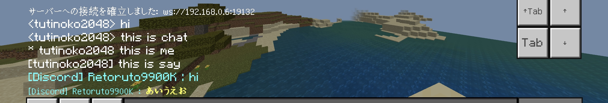
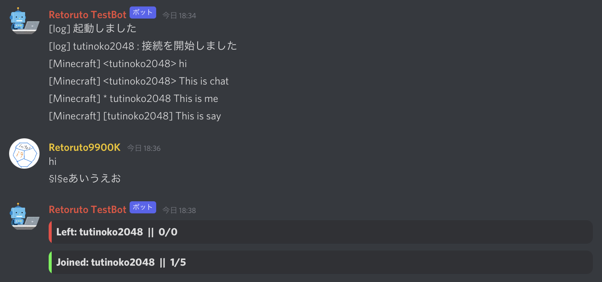
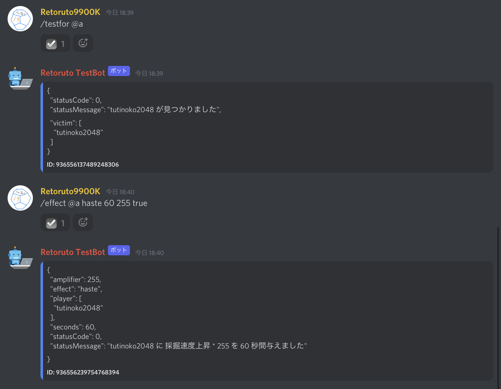
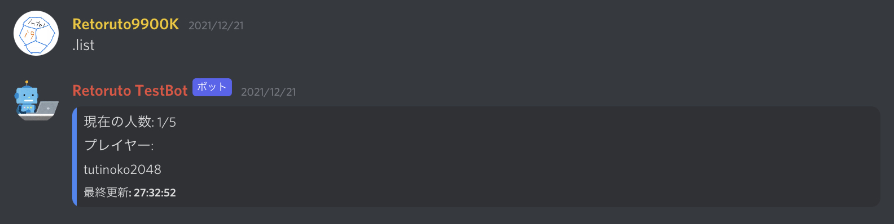

# discord-mcbe
websocketでマイクラとdiscordを繋ぐやつです。<br>
MinecraftBE バニラ環境で動かせます。<br>
https://youtu.be/BEv4oozeQKU<br>
<br>
<br>
<br>
<br>
<br>

## 使い方
### インストール
pcの場合はnodejsをインストール<br>
https://nodejs.org/ja/<br>
<br>
~~iosはplay.js~~ Discord.js v13への移行により、Nodejsのバージョンが古いplay.jsは使えなくなりました。<br>
androidはtermuxというアプリがおすすめです。<br>

### botの準備
discordのbotが必要なので用意してください。

### コピペしてみよう
config.jsonにサーバーのポート,discordbotのtoken,メッセージを送信するチャンネルのIDを入力してください。<br>
必要なモジュールも入れておいてください

### 動かす
サーバーを動かしてから、マイクラ側で<br>
```/connect [ipアドレス]:[ポート]```
または<br>
```/connect localhost:[ポート]```<br>
のコマンドを実行します<br>
これでチャットがどちらにも送られるようになるはずです

## /connectしても繋がらないときは
pc版で繋がらないときは<br>
```CheckNetIsolation.exe LoopbackExempt -a -n="Microsoft.MinecraftUWP_8wekyb3d8bbwe```<br>
をコマンドプロンプトで**管理者権限**で実行するといけるみたいです<br>
(ループバック接続を許可する設定らしい

## config.json
PORT: websocketをlistenするポート<br>
TOKEN: DiscordBOTのトークン<br>
CHANNEL: メッセージを送信するチャンネルのID<br>
PREFIX: コマンドのPrefix<br>
OPROLE: マイクラのコマンドを実行できる管理者ロールのID<br>
cmdResponse: コマンド実行時の結果を表示するかどうか<br>

<!--
## ワールド主じゃない人向け
GameTestを使用して全員のチャットをtellrawで流すことで、ワールドのホスト以外の人でもチャットを拾えるようになります<br>
tellrawで流す時はtranslateの`chat.type.text`を使用してください。<br>
```tellraw @a {"rawtext":[{"translate":"chat.type.text","with":["プレイヤー名","チャットのメッセージ"]}]}```
-->
