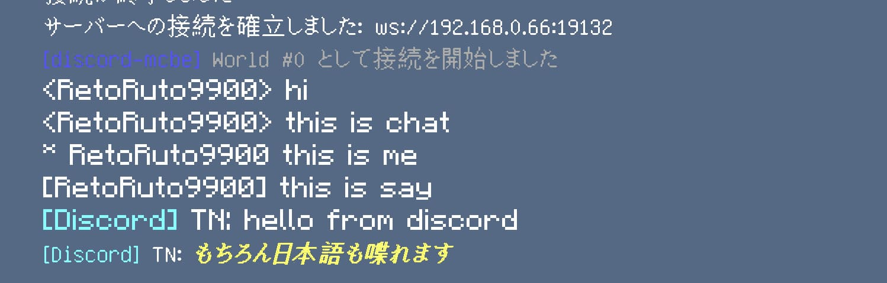
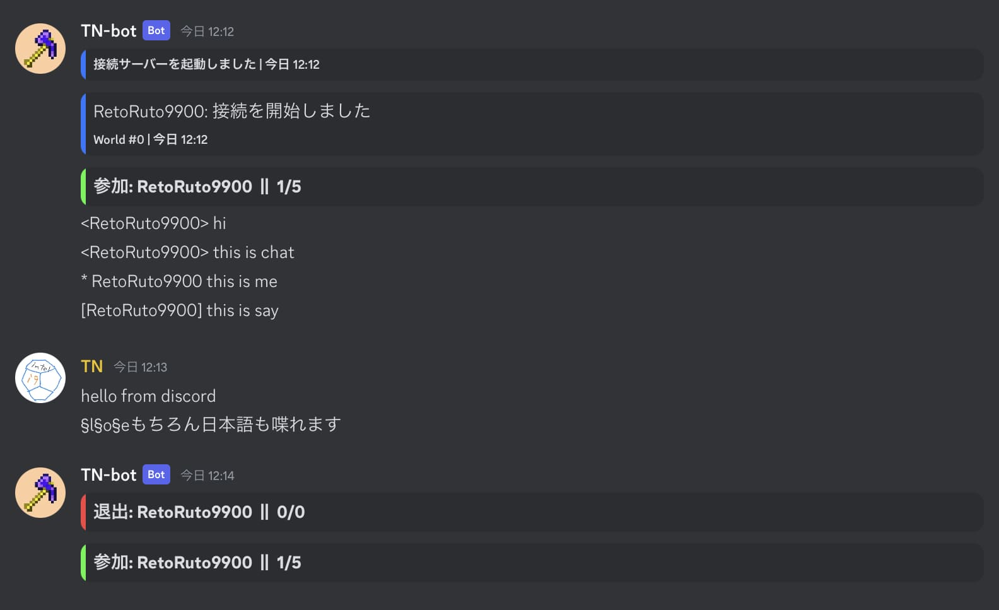

[日本語](./README_ja.md) | English

# discord-mcbe

A two-way bridge between Minecraft Bedrock Edition and Discord.

[Documentation](https://discord-mcbe.tn2048.workers.dev/) · [Releases](https://github.com/tutinoko2048/discord-mcbe/releases) · [Discord](https://discord.gg/XGR8FcCeFc)

discord-mcbe connects Minecraft worlds to a Discord text channel. It relays chat and world events and provides commands and status information through a Discord bot.

## Highlights

- Two-way chat between Minecraft and Discord
- Regular hosted worlds and Bedrock Dedicated Server support
- Multiple world connections
- Player lists, command execution, and a live status panel
- Configurable message filters and custom JavaScript scripts

## Project status

Version 4 is currently in beta. Its launcher, add-ons, configuration, and commands differ from stable version 3.

For installation, configuration, commands, troubleshooting, and development information, see the [official documentation](https://discord-mcbe.tn2048.workers.dev/).

## Screenshots

## Contributing

Bug reports, feature proposals, translations, and pull requests are welcome. Please use [GitHub Issues](https://github.com/tutinoko2048/discord-mcbe/issues) for reports and proposals.

## License

[MIT](./LICENSE)
