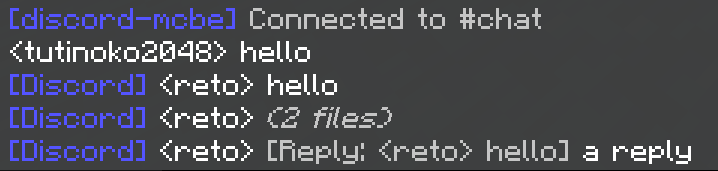
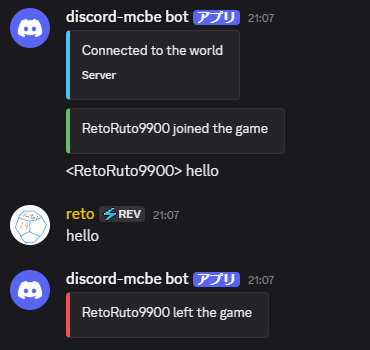

English | [日本語](./README_ja.md)

# discord-mcbe

 
 

A feature-rich, configurable Discord bridge for Minecraft Bedrock.

## Features

- Relay Minecraft chat to Discord and messages from a Discord channel to every connected world.
- Supports both regular worlds and Bedrock Dedicated Server (BDS), with multiple worlds connected at the same time.
- View player lists, execute Minecraft commands, and check ping from Discord.
- Customize message filters and displayed text, or freely extend functionality with custom scripts written in JavaScript or TypeScript.
- The JavaScript runtime is bundled, so setup is relatively easy without downloading additional software.

<table>
  <tr>
    <td></td>
    <td></td>
  </tr>
</table>

## Installation path

1. [Set up the discord-mcbe server](https://discord-mcbe.retomc.dev/en/installation/setup-bot/)
2. [Install the add-on in a regular world or BDS](https://discord-mcbe.retomc.dev/en/installation/setup-world/)
3. Start the world and connect it

For details, see the [documentation](https://discord-mcbe.retomc.dev/en/).

## Downloads

Use the [launcher](https://discord-mcbe.retomc.dev/en/installation/setup-bot/) to install and update the discord-mcbe server.

Installing an [add-on](https://discord-mcbe.retomc.dev/en/installation/setup-world/) in the world is required to connect. Install the version compatible with the server (bot).

Continue with the [installation guide](https://discord-mcbe.retomc.dev/en/installation/setup-bot/) for Discord bot creation, extraction, and configuration.

## Guides

- [Features and commands](https://discord-mcbe.retomc.dev/en/guides/commands/)
- [Configuration](https://discord-mcbe.retomc.dev/en/guides/configuration/)
- [Translations and displayed text customization](https://discord-mcbe.retomc.dev/en/guides/translation-overrides/)
- [Custom scripts](https://discord-mcbe.retomc.dev/en/guides/custom-scripts/)
- [Troubleshooting](https://discord-mcbe.retomc.dev/en/guides/troubleshooting/)
- [Development guide](https://discord-mcbe.retomc.dev/en/development/)
- [API reference](https://discord-mcbe.retomc.dev/reference/)

## License

[MIT License](./LICENSE)
