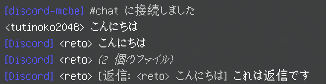
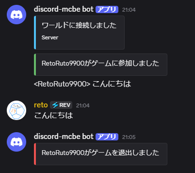

[English](./README.md) | 日本語

# discord-mcbe

 
 

Minecraft統合版のための高機能Discord連携Botです。

## 主な機能

- MinecraftのチャットをDiscordへ、Discordチャンネルのメッセージを接続中の全ワールドへ届けます。
- 通常のワールドとBedrock Dedicated Server（BDS）の**両方**に対応。また、複数のワールドに同時接続することができます。
- Discordからプレイヤーリスト、Minecraftコマンドの実行、pingを確認することができます。
- メッセージフィルターや表示テキストのカスタマイズ、JavaScript/TypeScriptを使ったカスタムスクリプトで自由に機能を拡張できます。
- JavaScriptランタイムを同梱しているため、面倒なソフトのダウンロード等をせずに(比較的)簡単にセットアップできます。

<table>
  <tr>
    <td></td>
    <td></td>
  </tr>
</table>

## 導入の流れ

1. [discord-mcbeサーバーをセットアップする](https://discord-mcbe.retomc.dev/installation/setup-bot/)
2. [ローカルワールドまたはBDSにアドオンを導入する](https://discord-mcbe.retomc.dev/installation/setup-world/)
3. ワールドを起動して接続する

詳しい内容は [公式ドキュメント](https://discord-mcbe.retomc.dev/) で解説しています！

## ダウンロード

[ランチャー](https://discord-mcbe.retomc.dev/installation/setup-bot/)はdiscord-mcbeサーバーのインストールとアップデートに使用します。

接続するにはワールドへの[アドオン](https://discord-mcbe.retomc.dev/installation/setup-world/)の導入が必須です。インストールするサーバー(bot)に対応したバージョンのものを導入してください。

Botの作成や展開後の設定を含む手順は、[導入ガイド](https://discord-mcbe.retomc.dev/installation/setup-bot/)を参照してください。

## ガイド

- [機能とコマンド](https://discord-mcbe.retomc.dev/guides/commands/)
- [設定](https://discord-mcbe.retomc.dev/guides/configuration/)
- [翻訳と表示テキストのカスタマイズ](https://discord-mcbe.retomc.dev/guides/translation-overrides/)
- [カスタムスクリプト](https://discord-mcbe.retomc.dev/guides/custom-scripts/)
- [トラブルシューティング](https://discord-mcbe.retomc.dev/guides/troubleshooting/)
- [開発ガイド](https://discord-mcbe.retomc.dev/development/)
- [APIリファレンス](https://discord-mcbe.retomc.dev/reference/)

## ライセンス

[MIT License](./LICENSE)
