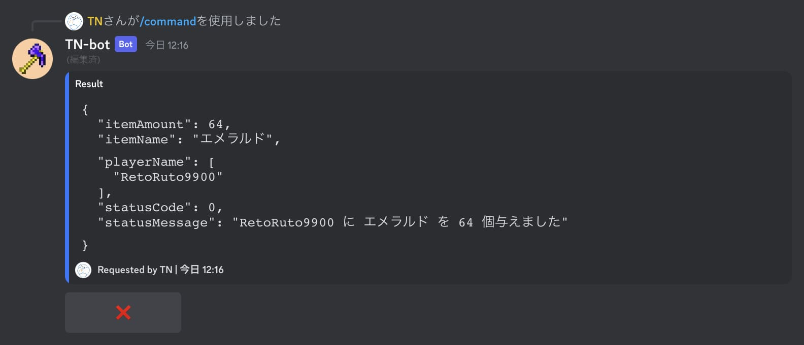
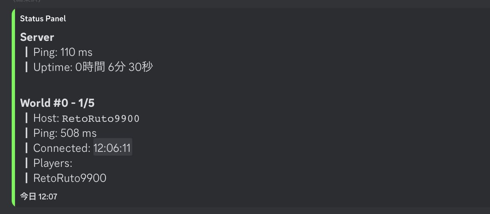

日本語 | [English](./README.md)

# discord-mcbe

Minecraft統合版とDiscordのチャットを繋ぐDiscord Botです。

## 主な機能

- MinecraftとDiscordのチャット連携
- DiscordからMinecraftへのコマンド送信
- 複数ワールドへの同時接続
- プレイヤーリストの表示 (Discord)
- オンライン状況をリアルタイムで表示するステータスパネル (Discord)
- カスタムスクリプトの実行 (詳しくは[こちら](#カスタムスクリプトの実行))

## 導入方法
[導入方法の詳細はこちら](./docs/installation_ja.md)

## コマンド一覧

- /help  
  ボットのヘルプを表示します

- /ping  
  ボットとワールドの応答速度を表示します

- /list  
  プレイヤーリストを表示します

- /command <コマンド> [ワールド]  
  ワールドにコマンドを送信します。従来通りメッセージから送信することも可能です。  
  [詳しくはこちら](#コマンドの実行)

- /tell <送り先> <メッセージ>  
  tellでメッセージをプレイヤーに送信します。周りからは見られません

- /panel get  
  ステータスパネルのあるチャンネルを表示します  
  [詳しくはこちら](#ステータスパネル)

- /panel set  
  ステータスパネルを表示するチャンネルを設定します

- /panel delete  
  ステータスパネルを削除します

## configを使ったカスタマイズ
`config.json`

## その他の機能

### コマンドの実行

`/command <送信するコマンド>` または `/送信するコマンド` でワールドにコマンドを送ることができます。  
専用ロールを作成し、configの`command_role_id`にロールIDを入力して権限を取得してください  
<!--  -->

### ステータスパネル

pingや人数の情報をリアルタイムで更新するパネルです  
`/panel set` で実行したチャンネルにパネルを設置します  
<!--  -->

### コンソール

コンソールからコマンドを送信することができます。

### カスタムスクリプトの実行

<!-- todo -->

### TNACとの連携

<!-- todo -->

## Contributing & Translation

<!-- todo -->
