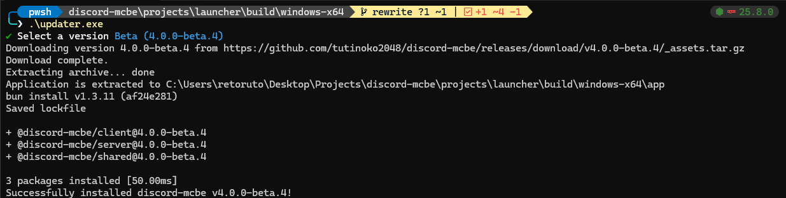

日本語 | [English](./installation.md)

- [導入方法](#導入方法)
  - [1. Discord Botの準備](#1-discord-botの準備)
  - [2. discord-mcbeサーバーの準備](#2-discord-mcbeサーバーの準備)
  - [3. Minecraft側の準備](#3-minecraft側の準備)
    - [ローカル(通常)ワールドの場合](#ローカル通常ワールドの場合)
    - [BDSのワールドの場合](#bdsのワールドの場合)
- [アップデート方法](#アップデート方法)

# 導入方法
## 1. Discord Botの準備
[Discord Developer Portal](https://discord.com/developers/applications) で新規アプリケーションを作成し、Botの準備を行う
- `Bot` → `Privileged Gateway Intents` → **`Message Content Intent`** を有効にする
- `トークンをリセット` をクリックしてBOTトークンを控えておく
- `OAuth2` → `OAuth2 URLジェネレーター`に進み、スコープの`bot`にチェックを入れる
  - 以下の権限を選択する
    - 必須:
      - `チャンネルの管理`
      - `チャンネルを表示`
      - `メッセージを送る`
      - `リンクを埋め込み`
      - `ファイルを添付`
      - `メッセージ履歴を読む`
    - 推奨:
      - `低速モードを回避`
  - 連携タイプ: `ギルドのインストール`
  - 生成されたURLにアクセスし、Botをサーバーに招待する

## 2. discord-mcbeサーバーの準備
- [リリースページ](https://github.com/tutinoko2048/discord-mcbe/releases) から最新の discord-mcbe launcher をダウンロードして展開する
- `.env` ファイルに必要な環境変数を設定する

| 環境変数 |  | 説明 |
| --- | --- | --- |
| **`DISCORD_TOKEN`** | 必須 | Bot作成時に控えたトークン |
| **`GUILD_ID`** | 必須 | Botを招待したサーバー(Guild)のID |
| **`CHANNEL_ID`** | 必須 | Botがメッセージを送るチャンネルのID |
| (`SOCKET_PORT`) | 任意 | ローカル(通常の)ワールドとのWebSocket通信に使用するポート |
| (`BRIDGE_PORT`) | 任意 | Bedrock Dedicated Serverとの通信に使用するポート |

- `start.cmd` または `start.sh` を実行してサーバーを起動する

## 3. Minecraft側の準備
- [リリースページ](https://github.com/tutinoko2048/discord-mcbe/releases) から最新の discord-mcbe client (アドオン) をダウンロードし、ワールドに導入する

### ローカル(通常)ワールドの場合
- discord-mcbeのターミナルに出力されるコマンド (ex: `/connect localhost:3063`) をマイクラで実行する

### BDSのワールドの場合
- 自動で接続されます

# アップデート方法
discord-mcbe launcherには簡単に本体のアップデートを行えるCLIアップデートツールが同梱されています。

- `updater.exe` または `updater` を実行
- ターミナルの指示に従って操作する

  <a href="../README_ja.md">トップに戻る</a>

