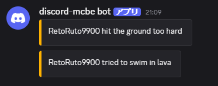

import { Icon } from '@astrojs/starlight/components';
import PickaxeIcon from '~icons/lucide/pickaxe';

## <Icon name="comment-alt" />Chat relay

### Minecraft → Discord


Normal chat from players in a connected world is sent to `CHANNEL_ID`. Join, leave, world-connect, and disconnect events are sent as embeds.

- When multiple worlds are connected, the world name is added to identify the source.
- Minecraft `§` color codes are removed by default.
- [Switch to webhook mode](/en/guides/configuration/#use-webhooks-for-chat-relay) to show the player name as the sender of the Discord message.

### Discord → Minecraft


Messages from users in `CHANNEL_ID` are broadcast to every connected world.

- Messages sent by this bot or other bots are not relayed.
- The member's Discord display name is used as the sender.
- Replies include the source author's name and a short content preview.
- Messages with attachments show the file count.
- [Message filters](/en/guides/configuration/#discord-message-filters) can shorten long messages or replace or reject content matching a regular expression.

## <Icon name="server" />Connecting to multiple worlds

discord-mcbe can connect multiple Minecraft worlds at the same time. Give each world a unique name so that messages can be identified by their source. See [world setup](/en/installation/setup-world/) for connection instructions.

After setting a world name with `/dmc:setname <name>`, specify `world` in Discord's `/list` or `/command` to target one world. Omitting `world` targets every connected world.


## Send death logs

When a player dies, discord-mcbe sends the Minecraft death message for the cause of death to Discord. When multiple worlds are connected, the source world name is also shown.

Use `bot.show_death_messages` in `config.json` to control death logs. It defaults to `true`; set it to `false` to disable them. See [configuration](/en/guides/configuration/#configjson) for details.



## <Icon name="discord" />Additional Discord commands

At startup, the bot registers commands in the Discord server specified by `GUILD_ID`.

| Command                                     | Permission    | Description                                        |
| ------------------------------------------- | ------------- | -------------------------------------------------- |
| `/ping`                                     | Everyone      | Show latency for the bot and every connected world |
| `/list [silent] [world]`                    | Everyone      | Show player counts and names                       |
| `/command <command> [raw] [world] [silent]` | Administrator | Execute a Minecraft command and display its result |
| `/panel create`                             | Administrator | Create the status panel in the current channel     |
| `/panel show`                               | Administrator | Show a link to the stored status panel             |

### `/command`

Enter the Minecraft command in `command` without a leading slash.

```text
/command time set day world:survival silent:true
```

- Omitting `world` executes the command in every connected world.
- `raw` displays the raw result as JSON.
- A result longer than the embed threshold is attached as `results.txt`.
- `silent` makes the response visible only to the person who ran it.

### `/panel` - Status panel

`/panel create` posts an embed that periodically refreshes with:

- Discord bot ping and uptime
- World name, host type, latency, and connection time
- Player count and player names
- The discord-mcbe version

Only one panel is stored. Creating another removes the old panel. Change the refresh interval in [configuration](/en/guides/configuration/#configjson).

### Command permissions

By default, commands marked as requiring Administrator permission can only be run by users with the server's Administrator permission. To change access for individual commands, open `Server Settings > Apps > Integrations > [Bot name] > Commands`.

## <PickaxeIcon font-size="0.85em" />Additional Minecraft commands

| Command               | Permission | Description                   |
| --------------------- | ---------- | ----------------------------- |
| `/dmc:discord-mcbe`   | Operator   | Open the settings form        |
| `/dmc:dmc`            | Operator   | Alias for `/dmc:discord-mcbe` |
| `/dmc:setname <name>` | Operator   | Change the world name         |
| `/dmc:disconnect`     | Host       | Disconnect from discord-mcbe  |

## <Icon name="desktop" />Server console

Type a Minecraft command into the terminal running discord-mcbe to execute it in every connected world.

```ansi
say Server maintenance starts in 10 minutes
```
