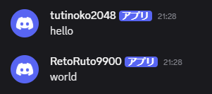

import { Aside, Code, Icon, Tabs, TabItem } from '@astrojs/starlight/components';
import { BDS_SCRIPT_MODULE_UUID } from '../../../../lib/bds-config';
import { defaultConfig } from '../../../../../../server/src/assets/default-config';

discord-mcbe splits its settings between two files:

- `.env` contains secrets and machine-specific values such as the bot token, Discord IDs, and listening ports.
- `config.json` contains detailed settings for language, displayed text, chat filters, and scripts.

Place both next to the launcher's `start.bat` or `start.sh`. Restart discord-mcbe after changing either file.

## <Icon name="padlock" />Environment variables

```dotenv
DISCORD_TOKEN=your_bot_token
GUILD_ID=123456789012345678
CHANNEL_ID=123456789012345678
SOCKET_PORT=3063
BRIDGE_PORT=23191
```

| Variable        | Required | Default | Description                                          |
| --------------- | :------: | ------- | ---------------------------------------------------- |
| `DISCORD_TOKEN` |    ✓     | —       | Bot token issued in the Developer Portal             |
| `GUILD_ID`      |    ✓     | —       | Discord server where slash commands are registered   |
| `CHANNEL_ID`    |    ✓     | —       | Text channel used for Minecraft chat relay           |
| `SOCKET_PORT`   |          | `3063`  | WebSocket port used by `/connect` for regular worlds |
| `BRIDGE_PORT`   |          | `23191` | Bridge port used by the BDS add-on                   |

<Aside type="danger" title="Do not share .env">
  Keep `.env` out of version control and remove tokens from logs before sharing them. Reset an exposed token
  in the Developer Portal.
</Aside>

## <Icon name="setting" />config.json

When `config.json` does not exist, the first start with a valid `.env` creates it with these defaults:

<Code code={JSON.stringify(defaultConfig, null, 2)} lang="json" title="config.json" />

| Key                            | Description                                                              |
| ------------------------------ | ------------------------------------------------------------------------ |
| `config_version`               | Configuration format version used for migration. Do not edit             |
| `language`                     | Bot and console language: specify an available locale                    |
| `timezone_offset`              | Integer-hour offset from UTC; defaults to the OS local time when omitted |
| `bot.show_death_messages`      | Send player death messages to Discord                                    |
| `bot.reply_preview_max_length` | Maximum Discord reply-preview characters shown in Minecraft              |
| `bot.strip_color_prefix`       | Remove Minecraft `§` color codes before relaying to Discord              |
| `bot.panel_update_interval`    | Status panel refresh interval in milliseconds                            |
| `bot.discord_message_filter`   | Filters applied before Discord content is sent to Minecraft              |
| `bridge.disable_encryption`    | Disable encryption for local-world connections. Normally keep `false`    |
| `script.entry`                 | Script file imported at startup                                          |
| `translation_overrides`        | Map of built-in translation keys to replacement strings                  |
| `debug`                        | Enable debug logging                                                     |

Unknown keys are ignored with a warning. An invalid type or value stops startup and prints the affected path.

## <Icon name="comment-alt" />Discord message filters

Filters run on messages received in `CHANNEL_ID` before they are sent to Minecraft. Configure either one object or an array in application order.

### <Icon name="list-format" />Limit message length

```json
{
  "on_fail": "shorten",
  "max_content_length": 160,
  "max_content_lines": 4
}
```

- `max_content_length` sets the character limit.
- `max_content_lines` sets the line limit.
- `on_fail: "shorten"` trims excess content and adds `..`.
- `on_fail: "cancel"` drops the entire message.

### <Icon name="magnifier" />Hide content matching a regular expression

```json
{
  "on_fail": "replace",
  "ignore_pattern": "https?://\\S+"
}
```

- `on_fail: "replace"` replaces every match with `***`.
- `on_fail: "cancel"` drops a message containing a match.

`ignore_pattern` is parsed as a JavaScript regular expression. Escape a backslash as `\\` inside JSON.

### <Icon name="random" />Apply multiple filters in order

```json
"discord_message_filter": [
  {
    "on_fail": "replace",
    "ignore_pattern": "https?://\\S+"
  },
  {
    "on_fail": "shorten",
    "max_content_length": 160,
    "max_content_lines": 4
  }
]
```

The same filters also process quoted reply previews. A reply source rejected by a `cancel` filter is represented as `***`.

## <Icon name="pencil" />Override displayed text

`translation_overrides` can replace individual built-in strings. Preserve placeholders such as `%0` and `%1`.

```json
"translation_overrides": {
  "minecraft.message": "§9[Discord]§r %0§r: %1§r",
  "discord.join": "🟢 %0 joined",
  "discord.leave": "🔴 %0 left"
}
```

For the full i18n model, key table, and contributor workflow, see [Translation and displayed text customization](/en/guides/translation-overrides/).

## <Icon name="server" />Change connection settings

<Tabs>
  <TabItem label="Regular world">
    Change `SOCKET_PORT` in `.env` and connect with `/connect localhost:new-port`.
  </TabItem>
  <TabItem label="BDS">
    Create <code>{`config/${BDS_SCRIPT_MODULE_UUID}/variables.json`}</code> in the BDS installation folder.
    Set `BRIDGE_URL` to the discord-mcbe WebSocket URL seen by the add-on, using the same port as
    `BRIDGE_PORT` in `.env`. `DEFAULT_WORLD_NAME` changes the initial world name. Restart BDS after changing
    these values.

    `variables.json` belongs in the <code>{`config/${BDS_SCRIPT_MODULE_UUID}/variables.json`}</code> path in the BDS installation folder, not in the add-on. Use this content:

    ```json
    {
      "BRIDGE_URL": "ws://localhost:23191"
    }
    ```

    When omitted, `BRIDGE_URL` defaults to `ws://localhost:23191`. To use Bearer authentication, see
    [Authenticate BDS connections](/en/guides/custom-scripts/#authenticate-bds-connections).

    A world name saved with `/dmc:setname` takes precedence over `DEFAULT_WORLD_NAME`.

  </TabItem>
</Tabs>

## <Icon name="link" />Use webhooks for chat relay



Normally, the Bot sends Minecraft chat, but you can use a webhook instead. To use one, add its URL to `.env`:

```dotenv
DISCORD_WEBHOOK_URL=https://discord.com/api/webhooks/123456789012345678/...
```

The `username` contains the player name and `content` contains the chat message. Startup, join, leave,
status-panel, and command messages continue to be sent by the Bot.

### Set a webhook icon

To set a custom icon, specify its URL with `bot.minecraft_chat_avatar_url`. In the URL, `{name}` is replaced
with the player name and `{pfid}` with the Script API `Player.persistentId`.

```json
"minecraft_chat_avatar_url": "https://example.com/faces/{pfid}"
```

```json
"minecraft_chat_avatar_url": "https://example.com/faces/{name}"
```
