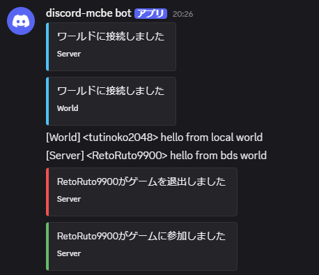
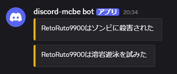

import { Aside, Icon } from '@astrojs/starlight/components';
import PickaxeIcon from '~icons/lucide/pickaxe';

## <Icon name="comment-alt" />チャット連携

### Minecraft → Discord


接続中のワールドでプレイヤーが送信した通常のチャットを`CHANNEL_ID`へ転送します。参加、退出、ワールド接続、切断も埋め込みメッセージで通知します。

- 複数ワールド接続時には、識別のためにワールド名がメッセージへ追加されます。
- Minecraftの`§`カラーコードはデフォルトで除去されます。
- [Webhookモードに切り替える](/guides/configuration/#チャット連携にwebhookを使う)ことで、プレイヤー名をdiscordメッセージの送信者として表示することができます

### Discord → Minecraft


`CHANNEL_ID`でユーザーが送ったメッセージを、接続中のすべてのワールドへ送ります。

- Bot自身や他のBotが送信したメッセージは転送しません。
- Discord上の表示名を送信者名に使用します。
- 返信メッセージは返信先の名前と短い本文プレビューも表示します。
- 添付ファイルのあるメッセージはファイル数を通知します。
- [メッセージフィルター](/guides/configuration/#discordメッセージフィルター)で長文や正規表現に一致する内容を短縮・置換・破棄できます。

## <Icon name="server" />複数ワールドへの接続

discord-mcbeは、複数のMinecraftワールドを同時に接続できます。各ワールドに重複しない名前を設定すると、Discord上で送信元を識別できます。接続方法は[ワールドのセットアップ](/installation/setup-world/)を参照してください。

`/dmc:setname <名前>`でワールド名を設定したあと、Discordの`/list`や`/command`で`world`を指定すると、対象ワールドだけを選択できます。`world`を省略した場合は、接続中のすべてのワールドが対象です。



## 死亡ログの送信

プレイヤーが死亡すると、死亡原因に応じたMinecraftの死亡メッセージをDiscordへ送信します。複数ワールドを接続している場合は、送信元のワールド名も表示されます。

死亡ログの送信は、`config.json`の`bot.show_death_messages`で切り替えられます。既定値は`true`です。送信しない場合は`false`に設定してください。詳しくは[設定](/guides/configuration/#configjson)を参照してください。



## <Icon name="discord" />Discord側の追加コマンド

Botは起動時に`GUILD_ID`で指定したDiscordサーバーへコマンドを登録します。

| コマンド                                     | 権限   | 説明                                           |
| -------------------------------------------- | ------ | ---------------------------------------------- |
| `/ping`                                      | 全員   | Botと接続中の各ワールドのpingを表示            |
| `/list [silent] [world]`                     | 全員   | プレイヤー数と一覧を表示                       |
| `/command <コマンド> [raw] [world] [silent]` | 管理者 | Minecraftでコマンドを実行し、結果を表示        |
| `/panel create`                              | 管理者 | 実行したチャンネルにステータスパネルを作成     |
| `/panel show`                                | 管理者 | 保存されているステータスパネルへのリンクを表示 |

### `/command`

`command`には先頭の`/`を付けずにMinecraftコマンドを入力します。

```text
/command time set day world:survival silent:true
```

- 引数`world`を省略すると、接続中のすべてのワールドで実行します。
- `raw`を有効にすると、実行結果をJSONで表示します。
- 結果が長い場合は`results.txt`として添付されます。
- `silent`を有効にすると、結果を実行者だけに見える形で表示します。

### `/panel` - ステータスパネル

`/panel create`は、次の情報を定期的に更新する埋め込みメッセージを現在のチャンネルに作成します。

- Discord Botのpingと稼働時間
- 接続中のワールド名、ホスト種別、Ping、接続時刻
- プレイヤー数とプレイヤー名
- discord-mcbeのバージョン

保存できるパネルは1つです。新しく作成すると古いパネルは削除されます。更新間隔は[設定](/guides/configuration/#configjson)で変更できます。

### コマンドの実行権限について

実行権限が「管理者」のコマンドは、デフォルトではサーバーの管理者権限を持つユーザーのみが実行できます。実行権限を変更したい場合は、`サーバー設定 > アプリ > 連携サービス > [BOT名] > コマンド` からコマンドごとに権限を変更できます。

## <PickaxeIcon font-size="0.85em" />Minecraft側の追加コマンド

| コマンド              | 権限         | 説明                            |
| --------------------- | ------------ | ------------------------------- |
| `/dmc:discord-mcbe`   | オペレーター | 設定画面を開く                  |
| `/dmc:dmc`            | オペレーター | `/dmc:discord-mcbe`のエイリアス |
| `/dmc:setname <名前>` | オペレーター | ワールド名を変更する            |
| `/dmc:disconnect`     | ホスト       | discord-mcbeから接続を切断する  |

## <Icon name="desktop" />サーバーコンソール

discord-mcbeが動作しているターミナルへMinecraftコマンドを入力すると、接続中の全ワールドで実行します。

```ansi
say Server maintenance starts in 10 minutes
```
