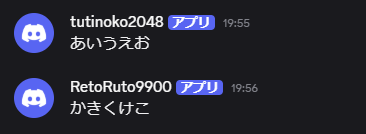

import { Aside, Code, Icon, Tabs, TabItem } from '@astrojs/starlight/components';
import { BDS_SCRIPT_MODULE_UUID } from '../../../lib/bds-config';
import { defaultConfig } from '../../../../../server/src/assets/default-config';

discord-mcbeの設定は2つのファイルに分かれています。

- `.env`: BOTトークン、DiscordのID、待ち受けポートなど、環境ごとに異なる値や機密情報
- `config.json`: 言語、表示テキスト、チャットフィルター、スクリプトなどの細かい設定

どちらもランチャーの`start.bat`または`start.sh`と同じフォルダーに置きます。変更後はdiscord-mcbeを再起動してください。

## <Icon name="padlock" />環境変数

```dotenv
DISCORD_TOKEN=Botのトークン
GUILD_ID=123456789012345678
CHANNEL_ID=123456789012345678
SOCKET_PORT=3063
BRIDGE_PORT=23191
```

| 変数            | 必須 | デフォルト | 説明                                                  |
| --------------- | :--: | ---------- | ----------------------------------------------------- |
| `DISCORD_TOKEN` |  ✓   | —          | Developer Portalで発行したBotトークン                 |
| `GUILD_ID`      |  ✓   | —          | スラッシュコマンドを登録するDiscordサーバーのID       |
| `CHANNEL_ID`    |  ✓   | —          | Minecraftとのチャット連携に使うテキストチャンネルのID |
| `SOCKET_PORT`   |      | `3063`     | ローカルワールドから`/connect`するWebSocketポート     |
| `BRIDGE_PORT`   |      | `23191`    | BDSアドオンが接続するBridgeポート                     |

## <Icon name="setting" />config.json

初回起動時に以下のような`config.json`が生成されます。必要に応じて値を変更してください。

<Code code={JSON.stringify(defaultConfig, null, 2)} lang="json" title="config.json" />

| キー                           | 説明                                                                |
| ------------------------------ | ------------------------------------------------------------------- |
| `config_version`               | 設定形式のバージョン。移行処理用なので変更しない                    |
| `check_for_updates`            | 起動時に新バージョンを確認するかどうか                              |
| `language`                     | Botとコンソールの言語。利用可能なロケールを指定                     |
| `timezone_offset`              | 表示時刻のUTCからのオフセット（整数時間）。省略時はOSのローカル時刻 |
| `bot.show_death_messages`      | プレイヤーの死亡メッセージをDiscordへ送る。                         |
| `bot.allow_addon_messages`     | 他のアドオンからDiscordへのメッセージ送信を許可する                 |
| `bot.reply_preview_max_length` | Discordの返信元本文をMinecraftに表示する最大文字数                  |
| `bot.strip_color_prefix`       | MinecraftからDiscordへ送る本文の`§`カラーコードを除去する           |
| `bot.panel_update_interval`    | ステータスパネルの更新間隔（ミリ秒）                                |
| `bot.discord_message_filter`   | DiscordからMinecraftへ送る本文に適用するフィルター                  |
| `bridge.disable_encryption`    | ローカルワールド接続の暗号化を無効にする。通常は`false`のまま       |
| `script.entry`                 | 起動時に読み込むスクリプトファイル                                  |
| `translation_overrides`        | 組み込み翻訳の一部を上書きするオブジェクト                          |
| `debug`                        | デバッグログを有効にする                                            |

定義されていないキーは警告とともに無視されます。型や値が不正な場合はエラー箇所を表示して起動を中止します。

## <Icon name="comment-alt" />Discordメッセージフィルター

フィルターは、`CHANNEL_ID`で受信したDiscordメッセージをMinecraftへ送る前に適用されます。1つのオブジェクト、または適用順の配列を指定できます。

### <Icon name="list-format" />長さを制限する

```json
{
  "on_fail": "shorten",
  "max_content_length": 160,
  "max_content_lines": 4
}
```

- `max_content_length`: 最大文字数
- `max_content_lines`: 最大行数
- `on_fail: "shorten"`: 超過部分を切り詰め、末尾に`..`を付ける
- `on_fail: "cancel"`: メッセージ全体を転送しない

### <Icon name="magnifier" />正規表現に一致する内容を隠す

```json
{
  "on_fail": "replace",
  "ignore_pattern": "https?://\\S+"
}
```

- `on_fail: "replace"`: 一致箇所を`***`に置き換える
- `on_fail: "cancel"`: 一致箇所を含むメッセージ全体を転送しない

`ignore_pattern`はJavaScriptの正規表現として解釈されます。JSON内ではバックスラッシュを`\\`のようにエスケープしてください。

### <Icon name="random" />複数を順番に適用する

```json
"discord_message_filter": [
  {
    "on_fail": "replace",
    "ignore_pattern": "https?://\\S+"
  },
  {
    "on_fail": "shorten",
    "max_content_length": 160,
    "max_content_lines": 4
  }
]
```

フィルターは返信元のプレビューにも適用されます。`cancel`で除外された返信元は`***`として表示されます。

## <Icon name="pencil" />表示テキストをカスタマイズする

`translation_overrides`では、組み込みの翻訳キーを個別に変更できます。`%0`、`%1`などのプレースホルダーはそのまま残します。

```json
"translation_overrides": {
  "minecraft.message": "§9[Discord]§r %0§r: %1§r",
  "discord.join": "🟢 %0 joined",
  "discord.leave": "🔴 %0 left"
}
```

詳しい仕組み、全キーの一覧、コントリビューター向けの変更方法は[翻訳と表示テキストのカスタマイズ](/guides/translation-overrides/)を参照してください。

## <Icon name="server" />接続先を変更する

<Tabs>
  <TabItem label="ローカルワールド">
    `.env`の`SOCKET_PORT`を変更し、`/connect localhost:変更後のポート`で接続します。
  </TabItem>
  <TabItem label="BDS">
    BDS本体のフォルダに<code>{`config/${BDS_SCRIPT_MODULE_UUID}/variables.json`}</code>
    を作成し、`BRIDGE_URL`にアドオンから見たdiscord-mcbeのWebSocket URLを設定します。ポートは`.env`の`BRIDGE_PORT`と同じ値にしてください。`DEFAULT_WORLD_NAME`で初期ワールド名も変更できます。設定変更後はBDSを再起動してください。

    `variables.json`はアドオンではなく、BDS本体のフォルダにある<code>{`config/${BDS_SCRIPT_MODULE_UUID}/variables.json`}</code>へ配置します。内容は次のとおりです。

    ```json
    {
      "BRIDGE_URL": "ws://localhost:23191"
    }
    ```

    `BRIDGE_URL`を省略した場合は`ws://localhost:23191`へ接続します。Bearer認証を使う場合は[カスタムスクリプトの認証設定](/guides/custom-scripts/#bds接続を認証する)も参照してください。

    `/dmc:setname`で保存済みのワールド名がある場合は、`DEFAULT_WORLD_NAME`より優先されます。

  </TabItem>
</Tabs>

## <Icon name="link" />チャット連携にWebhookを使う



通常はBotがMinecraftからのチャットを送信しますが、Webhookを使うこともできます。使用する場合は`.env`にWebhook URLを追加します。

```dotenv
DISCORD_WEBHOOK_URL=https://discord.com/api/webhooks/123456789012345678/...
```

`username`はプレイヤー名、`content`にはチャット本文が入ります。起動・参加・退出・ステータスパネル・コマンドの
メッセージは、これまで通りBotから送信されます。

### Webhookアイコンを指定する

独自のアイコンを設定したい場合は、`bot.minecraft_chat_avatar_url`でアイコンURLを指定できます。
また、URL中の`{name}`はプレイヤー名に、`{pfid}`はScriptAPIの`Player.persistentId`に置き換えられます。

```json
"minecraft_chat_avatar_url": "https://example.com/faces/{pfid}"
```

```json
"minecraft_chat_avatar_url": "https://example.com/faces/{name}"
```
