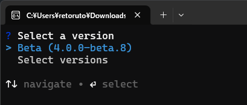
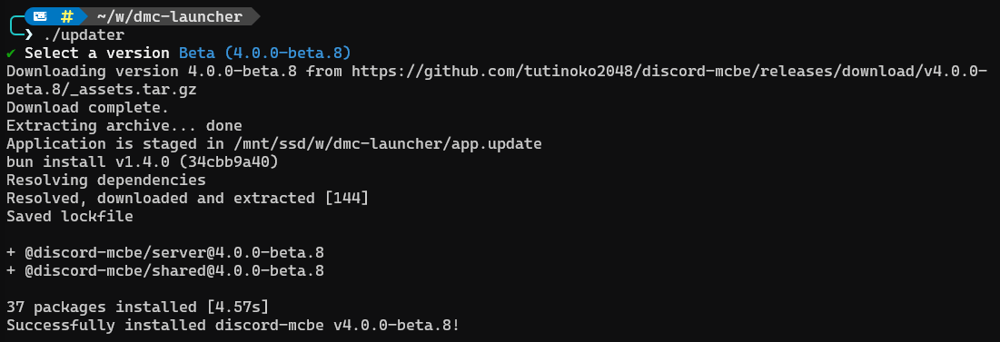

import { Aside, Steps, Tabs, TabItem } from '@astrojs/starlight/components';

<Aside type="caution" title="先にdiscord-mcbeを停止してください">
  起動中のdiscord-mcbe(ターミナル(黒い画面))を閉じてからアップデートしてください。
</Aside>

## 最新の安定版へ更新する

<Tabs syncKey="launcher-os">
<TabItem value="windows" label="Windows">

<Steps>

1. discord-mcbeのフォルダーにある`updater.exe`をダブルクリックします。

2. 起動時にランチャーの更新を確認します。新しいランチャーが見つかった場合は、更新するか確認されます。更新後に画面が閉じたら、`updater.exe`をもう一度ダブルクリックしてください。

3. バージョンの選択肢が表示されたら、上下キーで **Stable** を選び、Enterキーを押します。Stableは通常利用向けの安定版です。

   

4. 更新が終わるまで待ちます。`Successfully installed discord-mcbe ...` と表示されると、黒い画面は自動で閉じます。

5. `start.bat`をダブルクリックし、discord-mcbeを起動します。

</Steps>

</TabItem>
<TabItem value="unix" label="Linux / macOS">

<Steps>

1. discord-mcbeのフォルダーをターミナルで開きます。初回だけ、次のコマンドで実行権限を付けます。

   ```bash frame="none"
   chmod +x updater start.sh
   ```

2. ランチャーを起動します。

   ```bash frame="none"
   ./updater
   ```

3. 起動時にランチャーの更新を確認します。新しいランチャーが見つかった場合は、更新後に`./updater`をもう一度実行してください。

4. 上下キーで **Stable** を選び、Enterキーを押します。`Successfully installed discord-mcbe ...` と表示されたら更新完了です。

   

5. discord-mcbeを起動します。

   ```bash frame="none"
   ./start.sh
   ```

</Steps>

</TabItem>
</Tabs>

## コマンドでバージョンを直接指定する

通常は画面から **Stable** を選べば十分です。ベータ版、過去のバージョン、復元機能を使う場合は、コマンドで操作を指定できます。

<Tabs syncKey="launcher-os">
<TabItem value="windows" label="Windows">

PowerShellまたはコマンドプロンプトで実行します。

```powershell frame="none"
.\updater.exe [version] [options]
```

| したいこと                       | コマンド                       |
| -------------------------------- | ------------------------------ |
| 最新の安定版へ更新               | `.\updater.exe stable`         |
| 最新のベータ版へ更新             | `.\updater.exe beta`           |
| 指定バージョンをインストール     | `.\updater.exe 4.0.0`          |
| ランチャー自体を更新             | `.\updater.exe upgrade`        |
| 指定バージョンのランチャーへ更新 | `.\updater.exe upgrade 4`      |
| 直前のバージョンへ戻す           | `.\updater.exe rollback`       |
| 同じバージョンを再度入れる       | `.\updater.exe stable --force` |

</TabItem>
<TabItem value="unix" label="Linux / macOS">

ターミナルで実行します。

```bash frame="none"
./updater [version] [options]
```

| したいこと                       | コマンド                   |
| -------------------------------- | -------------------------- |
| 最新の安定版へ更新               | `./updater stable`         |
| 最新のベータ版へ更新             | `./updater beta`           |
| 指定バージョンをインストール     | `./updater 4.0.0`          |
| ランチャー自体を更新             | `./updater upgrade`        |
| 指定バージョンのランチャーへ更新 | `./updater upgrade 4`      |
| 直前のバージョンへ戻す           | `./updater rollback`       |
| 同じバージョンを再度入れる       | `./updater stable --force` |

</TabItem>
</Tabs>

`[version]`には次のどれかを指定します。省略すると、キーボードで選べる画面が開きます。

| 引数       | 動作                                                                 |
| ---------- | -------------------------------------------------------------------- |
| `stable`   | 最新の安定版を選ぶ                                                   |
| `beta`     | 最新のベータ版（動作確認用）を選ぶ                                   |
| `4.0.0`    | そのバージョンを選ぶ。数値はインストールしたいバージョンに置き換える |
| `upgrade`  | ランチャー自体を最新版へ更新する                                     |
| `rollback` | `app.backup/`に残っている直前のバージョンと入れ替える                |

### オプション

| オプション           | 用途                                                                                                   |
| -------------------- | ------------------------------------------------------------------------------------------------------ |
| `-f`, `--force`      | 同じバージョンの再インストールや、ベータ版から安定版への切り替えを強制する。バージョン引数と一緒に使う |
| `--dry-run`          | ファイルを更新せず、対象バージョンのダウンロードと検証まで行う                                         |
| `-c`, `--cwd <path>` | 現在開いているフォルダーではなく、指定したフォルダーを更新する                                         |
| `--no-interactive`   | 選択画面と確認を表示しない。バージョンを省略した場合は最新の安定版を選ぶ                               |
| `-v`, `--version`    | ランチャー自体のバージョンを表示する                                                                   |
| `-h`, `--help`       | 利用できるコマンドとオプションを表示する                                                               |

## 更新後に問題が起きた場合

更新が成功すると、更新前の本体は`app.backup/`に残ります。discord-mcbeを停止し、`./updater rollback`を実行すると、直前のバージョンへ戻せます。

ランチャー自体を更新する場合は、`updater upgrade`を実行します。通常は画面から起動したときにも自動で更新を確認します。
